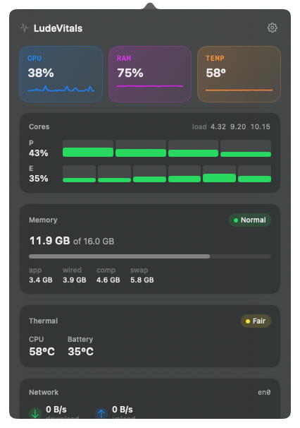

# LudeVitals

> A modern, native macOS menu bar system monitor. Lightweight by design.

LudeVitals shows your Mac's vital signs (CPU, RAM, temperature, fans, network, and battery) right in the menu bar, with a clean popover for the full report. Built in Swift + SwiftUI. No Electron. No telemetry. No background daemons.

<p align="center">
  
</p>

## Why

Most system monitors are either heavyweight Electron apps that consume more RAM than they report, or paid utilities with feature creep. LudeVitals does one thing: it answers "what is my Mac doing right now?" instantly, natively, and with a clear visual hierarchy.

- **Native.** Pure Swift + SwiftUI + AppKit. ~600 KB binary. Idle footprint < 30 MB RAM, < 0.3% CPU.
- **Honest.** All metrics read from the kernel directly. No network requests. Ever.
- **Customizable.** Choose what shows in the menu bar: temp only, temp + RAM, the full board, or pick your own.
- **Open.** All sensor access patterns documented in source. No black-box magic.

## Features

**Menu bar**
- Display modes: Minimal (temp), Balanced (temp + RAM), Full (CPU + RAM + temp + net), or Custom.
- Variable-width status item that resizes to its content.
- Right-click for Preferences and Quit.

**Popover (click the menu bar)**
- Hero tiles for CPU, RAM, and temperature with live sparklines.
- Per-core breakdown with P-core / E-core grouping on Apple Silicon.
- Memory: app / wired / compressed / cached / free / swap with pressure indicator.
- Thermal: CPU & GPU die temps, fan RPMs, throttle pressure.
- Network: real-time up/down rates, primary interface.
- Battery: percentage, time remaining, cycle count, health, instantaneous wattage.
- Top processes by CPU or RAM.

**Preferences**
- Sampling interval (1–5 seconds).
- Temperature unit (°C / °F).
- Launch at login (via `SMAppService`).

## Requirements

- macOS 14 Sonoma or later
- Apple Silicon (M1 or newer)
- Xcode Command Line Tools (for building from source)

> Intel support is intentionally not included in v1. Apple Silicon thermal sensors require a completely different code path (IOReport / private IOHID) than Intel (SMC), and we chose to do one well rather than both poorly. Pull requests welcome.

## Install

### Download (recommended)

Grab the latest DMG from the releases page:

**[⬇ Download LudeVitals-0.1.0.dmg](https://github.com/dimitris-di/LudeVitals/releases/latest/download/LudeVitals-0.1.0.dmg)**

Open the DMG and drag `LudeVitals.app` to `/Applications`.

> **The app is not signed or notarized yet.** Apple's Gatekeeper will block it on first launch with a *"LudeVitals cannot be opened because the developer cannot be verified"* error. To allow it, run this once in Terminal:
>
> ```bash
> xattr -dr com.apple.quarantine /Applications/LudeVitals.app
> ```
>
> Then open it again and it will launch normally. This strips the macOS quarantine flag from a locally-trusted app. You only need to do this on first install (and after each update until signing is in place).
>
> If you'd rather not run the command, you can also right-click the app in Finder → **Open** → **Open** to bypass the warning one time per version.

A signed + notarized build is on the [roadmap](#roadmap).

### Build from source

```bash
git clone https://github.com/dimitris-di/LudeVitals.git
cd LudeVitals
make install
```

`make install` builds in release mode, assembles the `.app` bundle, ad-hoc codesigns it, copies it to `/Applications`, and launches it. The first run will sit silently in the menu bar; give it 2 seconds to take its first sample.

Other targets:
- `make app`: build the bundle in the project directory
- `make run`: build and launch from the project directory
- `make dmg`: produce `LudeVitals-<version>.dmg` for distribution
- `make icon`: regenerate `Resources/AppIcon.icns`
- `make benchmark`: print binary size and idle CPU / RSS for the running app
- `make kill`: quit a running instance
- `make clean`: remove build artifacts

On managed Macs you may need `sudo make install` because `/Applications` is not user-writable.

## Customizing what's shown

Right-click the menu bar icon → **Preferences…**. Pick a display mode, or choose Custom and toggle individual metrics. Your selection is persisted across launches.

The popover always shows the full report regardless of menu bar mode.

## Architecture

```
LudeVitals/
├─ App/                  AppDelegate, status-item entry point
├─ Models/               MetricSnapshot (the data contract), RingBuffer, Settings
├─ Services/             SamplingScheduler: single timer, fans out to samplers
├─ Metrics/              One sampler per metric family
│   ├─ CPUSampler        Mach host_processor_info + per-core delta + P/E detection
│   ├─ MemorySampler     host_statistics64 + sysctl
│   ├─ NetworkSampler    getifaddrs + delta sampling
│   ├─ BatterySampler    IOPSCopyPowerSourcesInfo + AppleSmartBattery registry
│   ├─ ThermalSampler    Combines IOHID sensors + SMC fans
│   └─ Backends/
│       ├─ IOHIDThermalReader   Private IOHIDEventSystemClient for Apple Silicon dies
│       └─ IOReportFanReader    AppleSMC userclient for fan RPM
└─ Views/                SwiftUI: menu bar label, popover, preferences
```

### Sampling model

A single `DispatchSourceTimer` runs on a background utility queue. Every tick (default 2 s, 1 s while the popover is open), the scheduler synchronously calls each sampler, assembles a `MetricSnapshot`, and publishes it on the main actor. Subscribers (menu bar label, popover) consume via `@Published`. A 60-snapshot ring buffer feeds the sparklines.

Samplers are stateful between ticks (they hold previous CPU ticks, previous byte counters, previous per-PID times) but never allocate from the timer queue beyond what the OS API forces.

### Thermal access on Apple Silicon

Apple does not expose CPU/GPU die temperatures via any public API. The widely used technique, pioneered in open-source projects like [Stats](https://github.com/exelban/stats), [asitop](https://github.com/tlkh/asitop), and [iStatistica](https://imagetasks.com/istatistica/), is to dlsym private symbols out of IOKit:

- `IOHIDEventSystemClientCreate` + matching dict `PrimaryUsagePage=0xff00, PrimaryUsage=0x5` enumerates temperature sensor services
- `IOHIDServiceClientCopyEvent(svc, kIOHIDEventTypeTemperature, 0, 0)` fetches a reading
- `IOHIDEventGetFloatValue(event, kIOHIDEventTypeTemperature << 16)` extracts °C

These symbols have been stable since macOS 11. If a future macOS version changes them, the thermal sampler degrades gracefully: temps go to `··`, the rest of the app keeps working.

Fan RPMs are read from `AppleSMC` keys (`F0Ac`, `F0Mn`, `F0Mx`, …) which Apple Silicon still exposes for fan-equipped Macs. MacBook Air and other fanless models return an empty list silently.

## Privacy

LudeVitals never connects to the network. There is no telemetry, no analytics, no auto-update check, no crash reporting service. The app reads kernel metrics, displays them, and ends. If you find a network connection coming out of LudeVitals, file a bug; it's almost certainly a sandboxing escape.

## Roadmap

- [ ] Code signing + notarization for distributed releases
- [ ] Intel Mac support (SMC thermal backend)
- [ ] Long-term history with SQLite store + day/week graphs
- [ ] GPU usage on Apple Silicon (IOReport)
- [ ] Disk I/O throughput
- [ ] Sleep cycles + thermal events timeline
- [ ] CLI companion (`lude-vitals --json` for scripting)

## Contributing

Issues and pull requests welcome. Please keep changes focused: one fix or one feature per PR, with a clear description. Match the existing code style: no narrative comments, no premature abstractions, no force-unwraps at module boundaries.

For non-trivial changes, open an issue first so we can align on direction before you spend time writing code.

## Acknowledgments

- The thermal-sensor technique is community knowledge first surfaced in [Stats by exelban](https://github.com/exelban/stats); go give that project a star.
- The macOS Mach / IOKit APIs are notoriously underdocumented; thanks to everyone who reverse-engineered them and wrote it up.

## License

[MIT](LICENSE). Do whatever you want, attribution appreciated.
